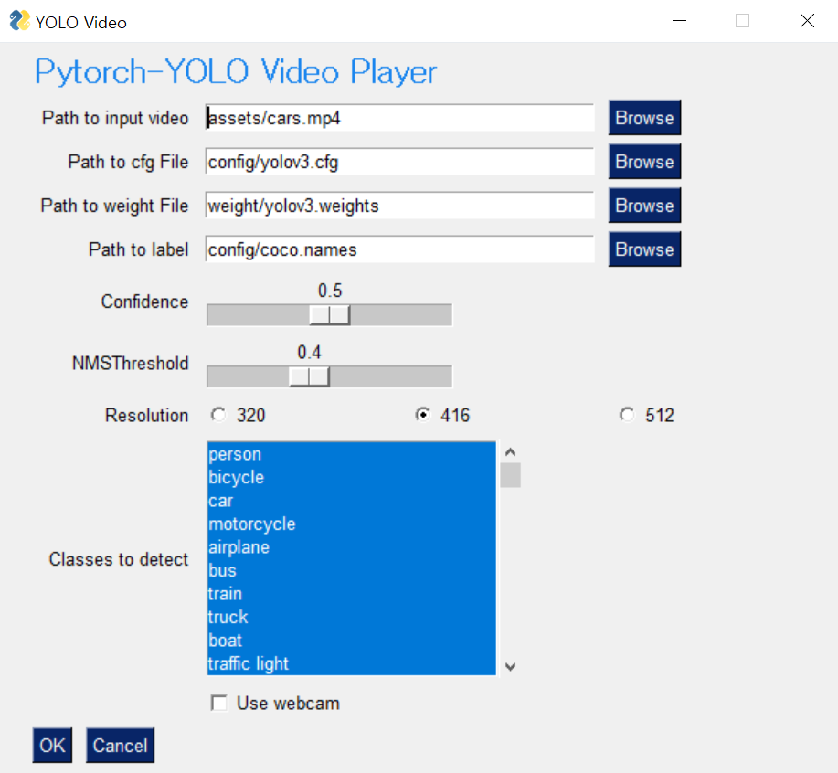

# Pytorch-YOLO with GUI
**한글**로 된 README를 보기 위해서는 해당 링크로 가면 됩니다 - [README-kr](/readme/README-kr.md)

### If you want the same implementation in `Tensorflow`, visit tensorflow_gui branch


While implementing, I referred to amazing implementations of other repositories listed below: 

* Pytorch-YOLO <br/>
https://github.com/eriklindernoren/PyTorch-YOLOv3.git<br/>
* GUI <br/>
https://github.com/PySimpleGUI/PySimpleGUI/tree/master/YoloObjectDetection<br/> 


## Requirements

* Python 3.6
* imutils 0.5.2<br> 
```pip install opencv-python imutils```
* torch 1.0
* torchvision 0.3.0<br>
```pip install torch==1.0 torchvision```


## How To Get YOLO v3 Pre-trained Models
There are two options to download YOLOv3 pre-trained model. First, visit [Darknet](https://pjreddie.com/darknet/yolo/) and download YOLO v3 weight file.
Second, write down following command:
```Shell
git clone https://github.com/dojinkimm/Pytorch_YOLO_GUI
cd Pytorch_YOLO_GUI/weight
wget https://pjreddie.com/media/files/yolov3.weights
```
After the command yolov3.weights file will be downloaded in weight directory.

## Running Demos
There are total 3 python files with different formats displaying the video. But,the GUI that is shown at the beginning is same for all.
In `pytorch_yolo_gui_window.py` and `pytorch_yolo_gui_faster_window.py` you can modify value of confidence and nmsthreshold in real time.
<div align="center">
    
</div>
To explain each parts:

* Path to input video - video file you want to display
* Path to cfg File - location of cfg file(yolov3.cfg)
* Path to weight File - location of weight file (yolov3.weight)
* Path to label names - location of label names (coco.names) 
* confidence - the value of confidence threshold
* NMSThreshold - the value of nms threshold
* Resolution - 416 is used in general (increasing value - higher accuracy, slow speed, decreasing value - higher speed, lower accuracy)
* Classes to detect - All classes of coco.names are selected as default, if you want to remove certain classes from being detected click them<br/>
Ex) if you click person, the video would not detect persons in the video<br/>
* Use webcam - if checked, webcam will be turned on<br/>

#### pytorch_yolo_gui.py
```Shell
python pytorch_yolo_gui.py
```
Video Result
<div align="center>
   
</div>

#### pytorch_yolo_gui_window.py
```Shell
python pytorch_yolo_gui_window.py
```
Video Result
<div align="center>
    
</div>

#### pytorch_yolo_gui_faster_window.py
```Shell
python pytorch_yolo_gui_window.py
```
Video Result
<div align="center>
    
</div>

### Credits:
Video by Pixabay from Pexels<br/>
Video by clara blasco from Pexels <br/>
Video by Pixly Videos from Pexels<br/>
Video by George Morina from Pexels <br/>
